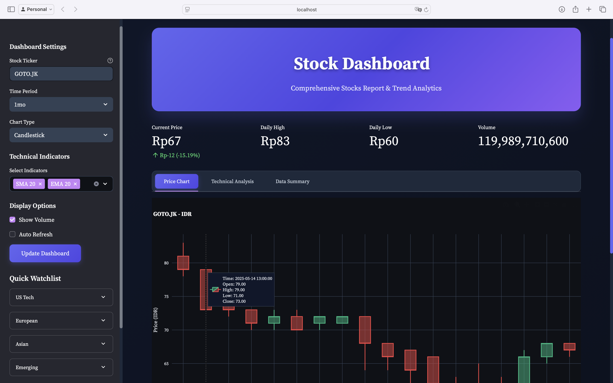
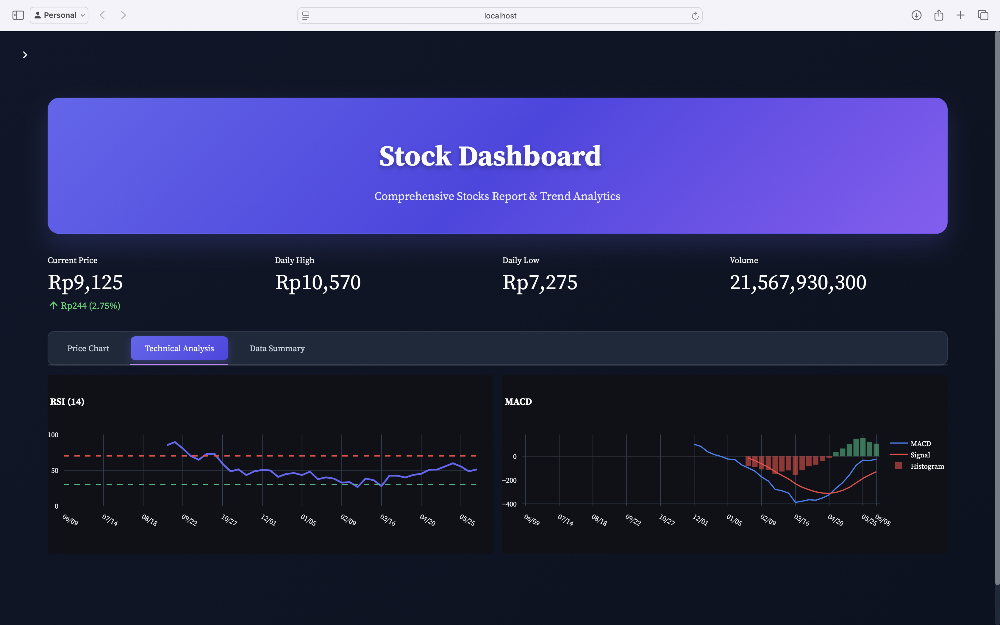

# Stock Dashboard 📈

A comprehensive, modern stock market dashboard built with Streamlit featuring real-time data visualization, technical analysis, and an elegant dark theme interface.


## ✨ Features

### 📊 Real-time Stock Data
- Live stock price tracking from Yahoo Finance
- Support for global markets (US, European, Asian, Emerging markets)
- Currency-aware price formatting
- Historical data analysis with multiple time periods

### 📈 Technical Analysis
- **Moving Averages**: SMA 20, SMA 50, EMA 20
- **RSI (Relative Strength Index)**: 14-period momentum oscillator
- **MACD**: Moving Average Convergence Divergence with histogram
- **Bollinger Bands**: Volatility indicator with upper/lower bands
- **Volume Analysis**: Trading volume with color-coded bars

### 🎨 Modern UI/UX
- **Dark Theme**: Elegant glassmorphism design
- **Responsive Layout**: Optimized for desktop and mobile
- **Interactive Charts**: Plotly-powered visualizations
- **Clean Interface**: Hidden Streamlit branding for professional look
- **Smooth Animations**: CSS transitions and hover effects

### 📱 Dashboard Components
- **Main Price Chart**: Candlestick or line chart with technical indicators
- **Volume Chart**: Color-coded volume bars
- **Technical Indicators**: Separate RSI and MACD charts
- **Quick Metrics**: Current price, daily high/low, volume
- **Analysis Summary**: Automated trend analysis and signals
- **Watchlist**: Quick access to popular stocks by category

## 🚀 Quick Start

### Prerequisites
- Python 3.8 or higher
- pip package manager

### Installation

1. **Clone the repository**
   ```bash
   git clone https://github.com/dafahentra/stocks-dashboard.git
   cd stock-dashboard
   ```

2. **Install dependencies**
   ```bash
   pip install -r requirements.txt
   ```

3. **Run the application**
   ```bash
   streamlit run stocks_dashboard.py
   ```

4. **Open in browser**
   - The app will automatically open at `http://localhost:8501`
   - If not, navigate to the URL shown in terminal

## 📋 Dependencies

```
streamlit
plotly
pandas
yfinance
ta
curl_cffi
```

## 🛠️ Usage

### Basic Usage
1. **Enter Stock Ticker**: Input any valid stock symbol (e.g., AAPL, GOOGL, GOTO.JK)
2. **Select Time Period**: Choose from 1 day to 5 years
3. **Choose Chart Type**: Candlestick or Line chart
4. **Add Indicators**: Select technical indicators to overlay
5. **Analyze**: View comprehensive analysis in multiple tabs

### Supported Stock Formats
- **US Stocks**: AAPL, GOOGL, MSFT, AMZN
- **European**: BMW.DE, ASML.AS, NESN.SW
- **Asian**: TSM, 7203.T, BABA
- **Emerging Markets**: GOTO.JK, BBCA.JK, VALE

### Technical Indicators
- **SMA/EMA**: Trend following indicators
- **RSI**: Momentum oscillator (30 oversold, 70 overbought)
- **MACD**: Trend and momentum indicator
- **Bollinger Bands**: Volatility and mean reversion

## 📁 Project Structure

```
stock-dashboard/
│
├── stocks_dashboard.py    # Main application file
├── components.py          # Chart and data components
├── styles.py             # Theme and styling configuration
├── requirements.txt      # Python dependencies
├── README.md            # Project documentation
└── LICENSE              # MIT License
```

## ⚙️ Configuration

### Custom Styling
The app uses a comprehensive dark theme defined in `styles.py`. You can customize:
- Color palette
- Chart themes
- UI components
- Animation effects

### Adding New Indicators
To add new technical indicators:
1. Import the indicator from `ta` library in `components.py`
2. Add calculation in `add_indicators()` function
3. Create visualization function
4. Add to indicator selection in main app

## 🎯 Features in Detail

### Real-time Data Processing
- Efficient data caching with Streamlit's `@st.cache_data`
- Automatic currency detection and formatting
- Robust error handling for API failures
- Support for different market intervals

### Chart Enhancements
- **Gap-free Charts**: Removes non-trading periods for cleaner visualization
- **Interactive Tooltips**: Detailed hover information
- **Responsive Design**: Adapts to different screen sizes
- **Professional Styling**: TradingView-inspired appearance

### Analysis Tools
- **Automated Signals**: Bullish/bearish trend detection
- **Volume Analysis**: Above/below average volume detection
- **Moving Average Crossovers**: Buy/sell signal generation
- **RSI Levels**: Overbought/oversold conditions

## 🔧 Troubleshooting

### Common Issues

1. **Data Not Loading**
   - Check internet connection
   - Verify ticker symbol is correct
   - Try different time periods

2. **Charts Not Displaying**
   - Ensure all dependencies are installed
   - Check browser compatibility
   - Clear browser cache

3. **Performance Issues**
   - Reduce time period for faster loading
   - Limit number of indicators
   - Check system resources

### Error Messages
- **"Unable to fetch data"**: Invalid ticker or API issue
- **"Error fetching"**: Network connectivity problem
- **"No data available"**: Stock may be delisted or market closed

## 🤝 Contributing

Contributions are welcome! Here's how to contribute:

1. **Fork the repository**
2. **Create feature branch** (`git checkout -b feature/AmazingFeature`)
3. **Commit changes** (`git commit -m 'Add AmazingFeature'`)
4. **Push to branch** (`git push origin feature/AmazingFeature`)
5. **Open Pull Request**

### Development Setup
```bash
# Clone your fork
git clone https://github.com/yourusername/stock-dashboard.git

# Create virtual environment
python -m venv venv
source venv/bin/activate  # Linux/Mac
# or
venv\Scripts\activate     # Windows

# Install dependencies
pip install -r requirements.txt

# Run in development mode
streamlit run stocks_dashboard.py --server.runOnSave true
```

## 📝 TODO / Roadmap

- [ ] Add cryptocurrency support
- [ ] Implement portfolio tracking
- [ ] Add more technical indicators (Stochastic, Williams %R)
- [ ] Create alerts and notifications
- [ ] Add export functionality (PDF reports)
- [ ] Implement user authentication
- [ ] Add news sentiment analysis
- [ ] Create mobile app version

## ⚖️ License

This project is licensed under the MIT License - see the [LICENSE](LICENSE) file for details.

## 👨‍💻 Author

**Dafa Hentra**
- GitHub: [@dafaHentra](https://github.com/dafahentra)
- Email: [dapahentra@gmail.com](mailto:dapahentra@gmail.com)

## 🙏 Acknowledgments

- **Yahoo Finance** for providing free stock data API
- **Streamlit** for the amazing web app framework
- **Plotly** for interactive chart capabilities
- **TA-Lib** for technical analysis calculations
- **TradingView** for chart design inspiration

## 📊 Screenshots

### Main Dashboard


### Technical Analysis


### Responsive Design


---

⭐ **Star this repo if you found it helpful!**

📢 **Share with fellow traders and developers!**

🐛 **Found a bug? Please create an issue!**